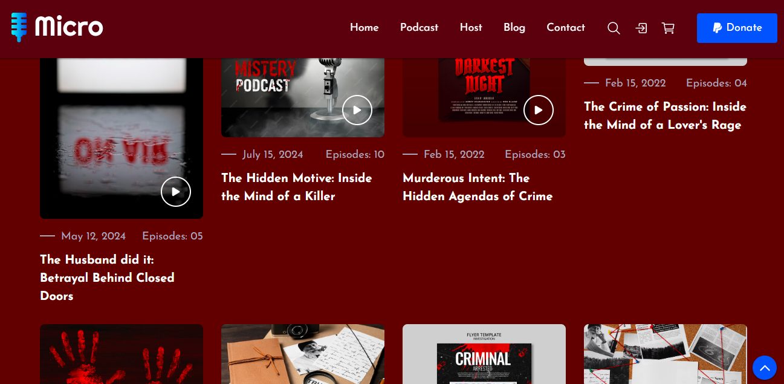

micro_pod
Welcome to micro_pod, a true crime website dedicated to exploring and documenting intriguing criminal cases. Our platform provides detailed case studies, investigative insights, 
and a community space for true crime enthusiasts to engage and discuss.

Features
Case Profiles: In-depth profiles of criminal cases, including timelines, evidence, and key figures.
Search Functionality: Easily search through cases, suspects, and locations.
Community Forums: Discuss cases and theories with fellow enthusiasts.
Latest Updates: Stay updated with the latest news and developments in the true crime world.
Resources: Access a variety of resources including articles, books, and documentaries related to true crime.

Usage
Browse Cases: Navigate through our case profiles and explore detailed information.
Search: Use the search bar to find specific cases or topics.
Join Discussions: Participate in community forums to discuss and share theories.
Stay Updated: Check the latest updates for news on recent developments and articles.

Demo
Check out our live site here: <a href="https://rehamhkee.github.io/micro_pod/">here</a> to see micro_pod in action. Alternatively, view our demo video for a walkthrough of the site’s features.

Contributing
We welcome contributions to micro_pod! To contribute:

1-Fork the repository.
2-Create a new branch (git checkout -b feature/your-feature).
3-Commit your changes (git commit -am 'Add new feature').
4-Push to the branch (git push origin feature/your-feature).
5-Create a new Pull Request.

Contact
For any questions or support, please reach out to rehamhakeem.official@gmail.com.
